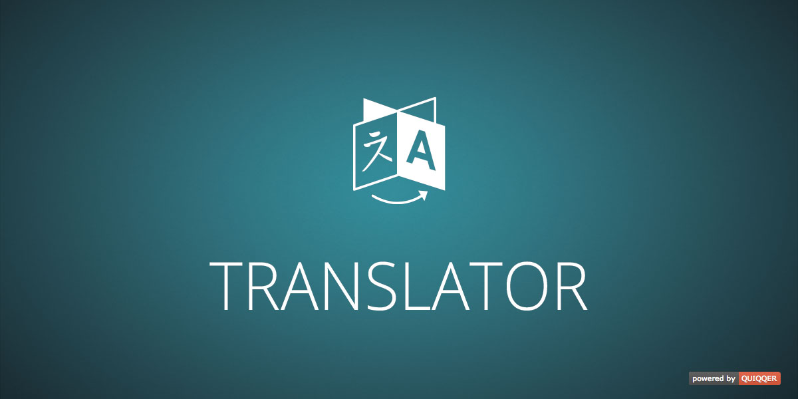

QUIQQER Übersetzer (Translator)
========

Das quiqqer/translation Paket erweitert QUIQQER um ein Übersetzungs-Panel und Übersetzungsfunktionen.
Mit dem quiqqer/translator ist es möglich, Übersetzungsvariablen zu editieren / hinzuzufügen oder zu löschen.
Zusätzlich können Übersetzungen (locale.xml Dateien) importiert und exportiert werden.

Übersetzungen werden in verschiedene Formate gespeichert, damit Übersetzungen performant eingesetzt werden können.
JavaScript- (Client) und PHP- (Server) Variablen werden getrennt aufbereitet und zur Verfügung gestellt.

Es wird versucht, auf gettext (http://php.net/manual/de/book.gettext.php) zurückzugreifen,
wenn dies der Server nicht unterstützt werden normale ini Dateien verwendet.

Paketname:

    quiqqer/translator

Features
--------

- Übersetzungs-Verwaltung
- Übersetzer API (XML, PHP, JavaScript)

Installation
------------

Der Paketname ist: quiqqer/translator

Mitwirken
----------

- Issue Tracker: https://dev.quiqqer.com/quiqqer/package-translator/issues
- Source Code: https://dev.quiqqer.com/quiqqer/package-translator/tree/master

Support
-------

Falls Sie Fehler gefunden, Wünsche oder Verbesserungsvorschläge haben, 
können Sie uns gern per Mail an support@pcsg.de darüber informieren.  
Wir werden versuchen auf Ihre Wünsche einzugehen bzw. diese an die 
zuständigen Entwickler des Projektes weiterleiten.

License
-------

- GPL-3.0+
